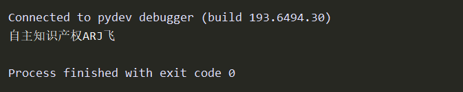

#  Image-based Sequence Recognition
This software implements the Convolutional Recurrent Neural Network (CRNN) in pytorch
#  Performance
## train loss

## test loss

## demo

# Dataset
The dataset I used is Synthetic Chinese String Dataset, you can also use your own data
1. Download the [dataset](https://pan.baidu.com/s/1ufYbnZAZ1q0AlK7yZ08cvQ) or your own data
2. Edit _dataset/txt/train.txt_ and _dataset/txt/test.txt_ according to your data     
eg:  
`20456343_4045240981.jpg 军（西点1912年班`  
`20457109_3410711018.jpg nd@djh-wl.`
3. Edit _dataset/txt/char_std_5990.txt_ according to your data     
# References
- [https://github.com/Sierkinhane/CRNN_Chinese_Characters_Rec#characters-recognition](https://github.com/Sierkinhane/CRNN_Chinese_Characters_Rec#characters-recognition)
- [https://github.com/bgshih/crnn](https://github.com/bgshih/crnn)
